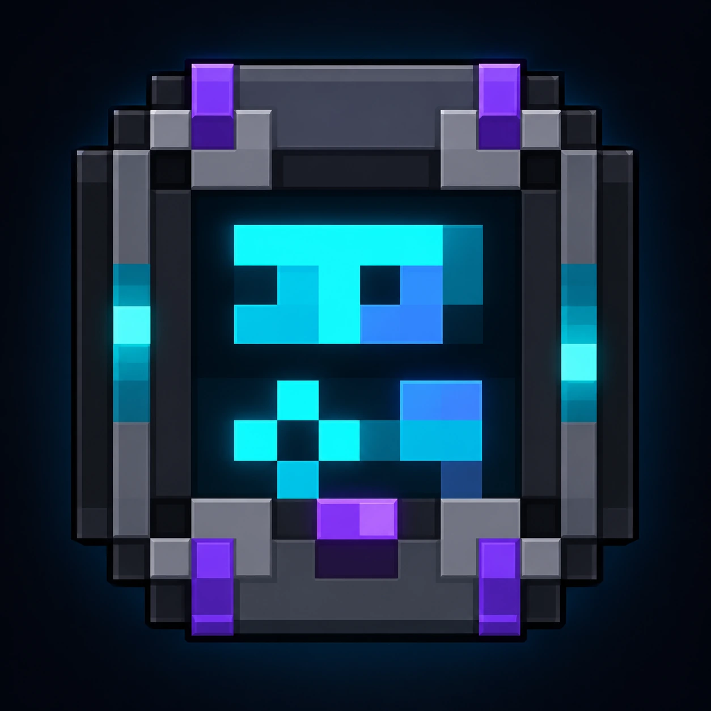
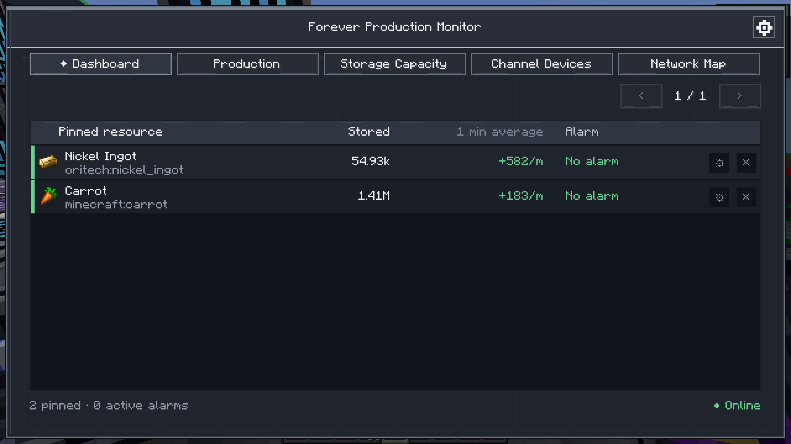
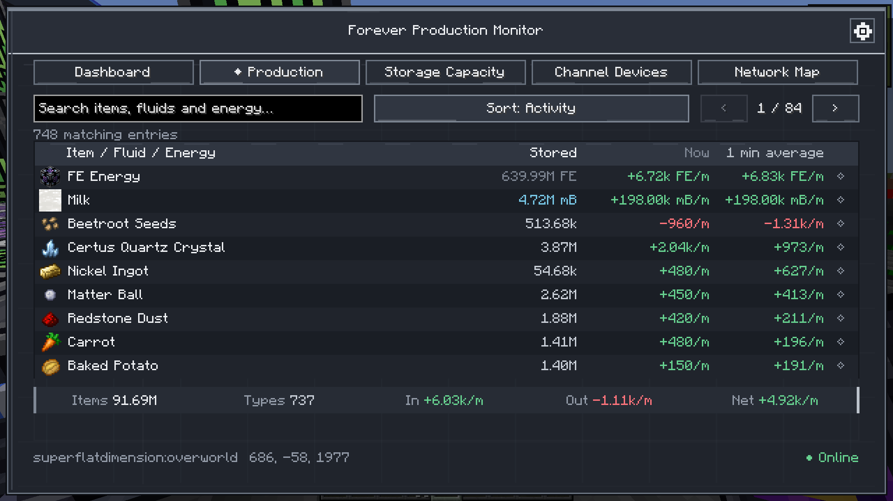
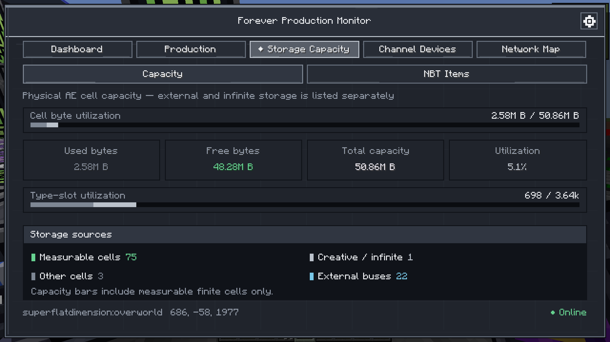
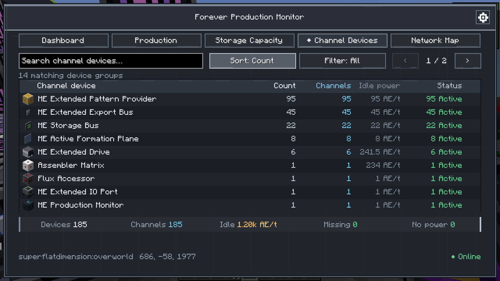
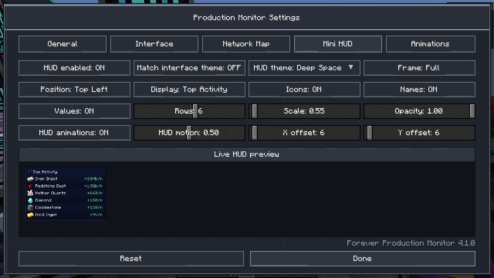
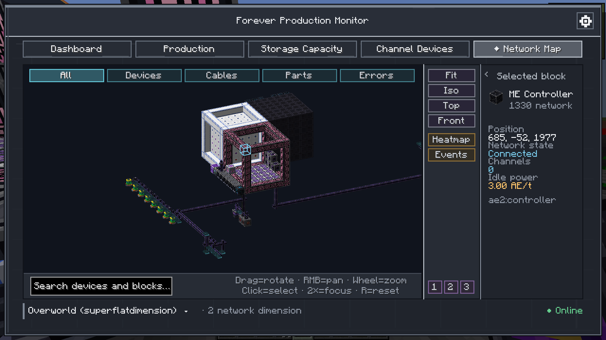
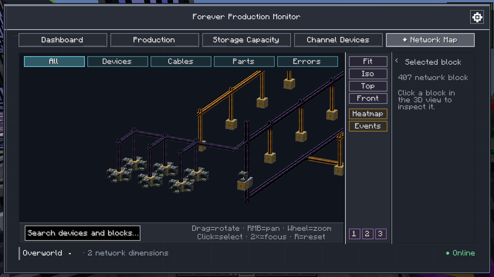

# Forever Production Monitor

**An AE2 production, storage and network diagnostics companion for Minecraft 1.21.1 / NeoForge.**

Forever Production Monitor turns a large AE2 network into something you can inspect instead of guess at. It combines live production statistics, storage and channel diagnostics, alarms, a configurable Mini HUD and an interactive 3D Network Map in a single tablet-style interface. Version 5.0.0 adds Crafting Diagnostics, a substantially expanded theme system, a full Custom Theme Designer and a more capable Mini HUD.

> Forever Production Monitor is an unofficial third-party addon for Applied Energistics 2. It is not affiliated with or endorsed by the Applied Energistics 2 development team.

## Downloads

Official release files will be published through:

- [GitHub Releases](https://github.com/TeKatz/ForeverProductionMonitor/releases)
- CurseForge (project link will be added when the public listing is approved)

Release changes are documented in [CHANGELOG.md](CHANGELOG.md). For safety and reproducibility, use the official project pages rather than third-party mirrors.

## Highlights

- **Production monitoring** for items, fluids and energy with configurable rate units.
- **Storage capacity overview** with used/free capacity information and dedicated NBT-item diagnostics.
- **Channel diagnostics** for powered, unpowered and missing-channel devices.
- **Missing Channel locator** to identify the actual device position, including networks that span multiple dimensions.
- **Dashboard and alarms** for important items, fluids and energy values.
- **Mini HUD** with configurable position, scale, opacity, frame and displayed information.
- **Interactive 3D Network Map** for visualising the physical structure of an AE2 network.
- **Multidimensional network navigation** through active AE2 Quantum Bridges.
- **ExtendedAE Wireless Connector navigation** for paired connectors inside the same dimension.
- **Network events** for topology, power and channel-state changes during the current play session.
- **Heatmap, search and filters** for exploring large networks.
- **Camera bookmarks and remembered views** for frequently inspected areas.
- **Multiple interface themes and animations** with configurable visual options.
- **Industrial monitor and tablet design** with three functional monitor states: OFFLINE, ONLINE and LINKED.

## 3D Network Map

The Network Map is designed for networks that have grown beyond what is practical to understand by walking around the base.

It can display AE2 devices, cables, multipart components and supported machines in a navigable 3D view. You can search the map, filter it by element type, inspect device state, use predefined camera angles, save camera bookmarks and enable a channel-load heatmap.

For networks connected through **AE2 Quantum Bridges**, the map detects the dimensions that belong to the same logical AE2 grid. Selecting a valid bridge allows **Follow Path** navigation to the paired bridge in the destination dimension.

When **ExtendedAE** is installed, paired **ME Wireless Connectors** can also be followed directly. Wireless Connector navigation remains inside the current dimension and is only enabled for a verified reciprocal connector pair.

Version 4.0.0 includes a dedicated performance pass for large maps: filtered node sets are cached, far off-screen nodes are culled on large scenes, projection work is reused per frame and cable heatmap calculations are performed lazily.

## Requirements and compatibility

| Component | Requirement |
| --- | --- |
| Minecraft | **1.21.1** |
| NeoForge | **21.1.249 or newer** |
| Applied Energistics 2 | **19.2.17 up to, but not including, 20.0.0** |
| Curios | **9.5.1+1.21.1 or newer** |
| Java | **21** |
| ExtendedAE | Optional; enables Wireless Connector path navigation |

Curios is declared as a required dependency by the mod metadata.

Forever Production Monitor is currently developed and tested for **NeoForge 1.21.1 only**. Fabric, Forge and other Minecraft versions are not supported by the current release.

## Installation

1. Install **Minecraft 1.21.1** with a compatible **NeoForge 21.1.x** version.
2. Install **Applied Energistics 2** and **Curios** using versions compatible with the table above.
3. Place the Forever Production Monitor JAR in the instance's `mods` folder.
4. Optionally install **ExtendedAE** to enable Wireless Connector navigation.
5. Start the game and verify that Forever Production Monitor appears in the Mods list.

Client and server should use the same Forever Production Monitor version when playing multiplayer.

## Using the mod

The Production Monitor tablet is the main interface for the mod. From it you can access production statistics, storage information, device/channel diagnostics, the dashboard and the Network Map.

The Network Map periodically requests a fresh snapshot while its tab is open. Large-map rendering and heatmap calculations are optimized in 4.0.0, but the feature is still intended as an inspection tool rather than something that must remain open permanently.

If a device reports **Missing Channel**, use the locator from the diagnostics view to identify its actual position. On multidimensional AE2 grids, the locator retains the device's real dimension instead of assuming the dimension of the linked monitor.

## Screenshots

### Production Tablet



The redesigned Production Tablet in 4.2.0 matches the monitor block's dark industrial frame and cyan, blue and violet accents. This front artwork is a presentation image; the in-game item uses a 16×16 texture.

### Dashboard



Pin important resources and check stored amounts, 1-minute averages and alarms at a glance.

### Production



Follow production and consumption for items, fluids and energy, including live rates and stored totals.

### Storage Capacity



Inspect storage bytes, type slots, storage sources and NBT-item diagnostics.

### Channel Devices



Review devices, channel usage, power and network status.

### Settings and Mini HUD



Configure the interface and Mini HUD with a live preview in the settings screen.

### Network Map: device detail



Select a device to inspect its position, network state, channels and idle power.

### Network Map: overview



Explore a large AE2 network using the interactive 3D view, search, filters, camera presets and dimension selection.

The interface screenshots are in-game captures from the development and test worlds.

## What's new in 5.0.0

- Added **Crafting Diagnostics** for jobs, patterns, providers, dependencies and direct crafting requests.
- Expanded and polished the visual theme system with richer animations and selected interactive elements.
- Added a full **Custom Theme Designer** and separate **Custom Mini HUD Designer** with live previews.
- Reworked Mini HUD settings with permanent preview, content filters, stored-amount sorting and compact category tabs.
- Preserved the existing Production, Storage, Channel Devices, Network Map, Quantum Bridge and ExtendedAE navigation workflows.

## Development and AI disclosure

Forever Production Monitor is **designed, directed and tested by Timo**.

The implementation has been produced extensively with **generative AI (ChatGPT/OpenAI)** under human direction and review. Timo defines the product direction, feature requirements, UI/UX decisions, acceptance criteria, test scenarios, bug reproduction and release approval. Architecture, implementation, refactoring, debugging and documentation are developed iteratively with AI assistance.

Every stable release is built from the source in this repository through GitHub Actions and is manually tested in-game before being accepted for release.

AI assistance is disclosed here intentionally so users and contributors can make an informed decision about using or reviewing the project.

## Project history

The source repository originated from a reconstruction of Timo's own stable **Forever Production Monitor 2.2.1** JAR after the original source was unavailable. It was **not** reconstructed from an unrelated third-party mod.

The historical baseline verification and the limits of that reconstruction are documented in [BASELINE.md](BASELINE.md).

Development since that baseline has been tracked in Git, including the later dashboard, alarm, storage, diagnostics and 3D Network Map work.

## Issues and support

Bug reports are welcome through the [GitHub issue tracker](https://github.com/TeKatz/ForeverProductionMonitor/issues).

When reporting a problem, please include:

- Forever Production Monitor version
- Minecraft and NeoForge versions
- Applied Energistics 2 version
- whether ExtendedAE or other AE2 addons are installed
- a clear description of what happened and what you expected
- relevant `latest.log` / crash-report excerpts when applicable
- screenshots when the issue concerns the UI or Network Map

For map or channel problems, describing whether the AE2 grid crosses dimensions through Quantum Bridges is especially useful.

## Modpacks

Forever Production Monitor may be included in modpacks in accordance with the MIT license.

If the pack uses the mod, make sure its required dependencies are also available for the selected Minecraft version. ExtendedAE remains optional unless the pack specifically relies on Wireless Connector navigation.

## Building from source

The project targets Java 21.

Linux / macOS:

```sh
./gradlew clean build --no-daemon
```

Windows:

```bat
gradlew.bat clean build --no-daemon
```

The resulting mod JAR is written to `build/libs/`.

GitHub Actions performs the same clean Java 21 build and uploads the resulting JAR as a workflow artifact.

## License

Forever Production Monitor is released under the **MIT License**. See [LICENSE](LICENSE).

Applied Energistics 2, ExtendedAE, Minecraft, NeoForge and Curios are separate projects with their own licenses, trademarks and project policies. Their names are used here only to describe compatibility and integration.
